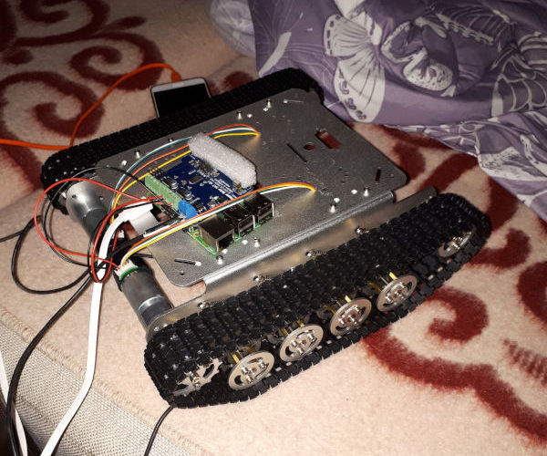

# Описание прогресса
В этом файле я буду рассказывать о прогрессе в работе над роботом. Детали заказываю на алиэкспрессе так что процесс будет неспешным.

## Сборка первых деталей
- Шасси для робота
- Raspberry pi 3B
- Плата драйвера для моторов и сервоприводов Stepper Motor HAT v0.1

После сборки шасси и подключения малины с драйвером к стационарному питанию получилось примерно следующее

Целая куча проводов от моторов это датчики Холла, не придумал для чего они могут понадобиться.

## Мысли о концепции управления
Изначально я планировал сделать управление через приложение blynk.cc и даже сделал прототип управления ([blynk.py](/blynk.py)), но потом я понял что в этом приложении уместить все элементы управления на маленьком экранчике смартфона не получится. Было решено пилить веб-интерфейс. В качестве языка бекэнда выбрал опять же Python, а фреймворком решил использовать Flask.