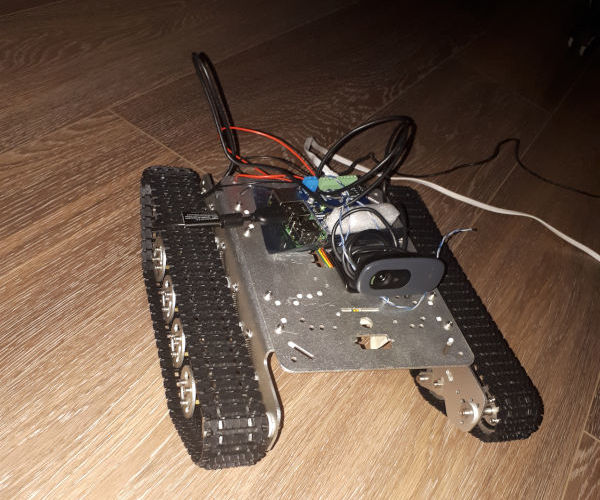

# Описание прогресса
В этом файле я буду рассказывать о прогрессе в работе над роботом. Детали заказываю на алиэкспрессе так что процесс будет неспешным.

## Сборка первых деталей
- Шасси для робота
- Raspberry pi 3B
- Плата драйвера для моторов и сервоприводов Stepper Motor HAT v0.1

После сборки шасси и подключения малины с драйвером к стационарному питанию получилось примерно следующее

Целая куча проводов от моторов это датчики Холла, не придумал для чего они могут понадобиться.

## Мысли о концепции управления
Изначально я планировал сделать управление через приложение blynk.cc и даже сделал прототип управления ([blynk.py](/blynk.py)), но потом я понял что в этом приложении уместить все элементы управления на маленьком экранчике смартфона не получится. Было решено пилить веб-интерфейс. В качестве языка бекэнда выбрал опять же Python, а фреймворком решил использовать Flask. Почти сразу стало понятно что делать интерфейс на ajax неправильно, получалась достаточно большая задержка. Так что я переписал все на websocket.

## Первая проба видео
Вначале я тупо взял самую простую веб-камеру и прикрутил ее к малине. Насколько я потом понял мне повезло с моделью, т.к. далеко не все камеры работают с малиной.

В качестве библиотеки для работы с видео была выбрана OpenCV. Пока на удивление все работало.

## Питание от аккумулятора
Дальше ко мне пришли детали для организации автономного питания:
 - LiPo аккумулятор (7.4v 5200mA/h)
 - Понижающий преобразователь питания с вольтметром (один для малины и еще один для драйвера моторов)
 - Модуль защиты от переразряда аккумулятора
 - Дешевая зарядка для 2-3s LiPo аккумов (iMax B3), в последсвии она накрылась и я заказал нормальную.
 
 После установки питания и понижающих модулей получилось примерно следующее:
 
 
 
 Модуль защиты аккумулятора от переразряда я пока ставить не стал, о нем речь пойдет ниже.

 ## Проблема с защитой аккумулятора
 Дальше я получил на почте сервоприводы и камеру для малины. И жадно бросился это все собирать и прикручивать. До этого момента особых проблем у меня не возникало и я даже в тайне начал подозревать себя в гениальности, но довольно быстро накосячил. 
 
 
 
 На картинке выше вы видите схему подключения модуля защиты аккумулятора от переразряда. Именно эту плату я выбрал по тому что питание отключалось посредством электрореле, а так же была возможность управления модулем по UART. 
 
 Небольшое отступление для тех кто не знает зачем эта полата. Дело в том что рабочий вольтаж каждого элемента питания LiPo аккумулятора от 3 до 4.2 вольт. У меня 2S аккум, значит в нем таких элемента два и общее рабочее напряжение должно быть от 6 до 8.4 вольта. Задача модуля защиты отключать питание, если общее напряжение на батарее выйдет за заданные пределы. Cамое страшное -- это падение напряжения ниже 3v на одной из банок, тогда она тупо умирает. 
 
 Вы наверное уже догадались что именно это со мной и произошло. Как выяснилось позже, вольтметр на плате безбожно врал если замерял напряжение на том же аккуме от которого был запитан сам модуль и показывал 7.1v хотя по факту напряжение на батарее упало уже ниже 4.5v. Скорее всего сыграло роль мое полное незнание электротехники, но так или иначе аккумулятор был испорчен, а вместе с ним и дешманская зарядка. К сожалению модуль был совсем нонеймовский и инфы по нему практически небыло, по этому при текущем положении вещей он был признан негодным и отложен, а я пошел заказывать на али новый аккум, нормальную зарядку нормальную защиту от разряда. 
 
## Проблема с процессами
Второй проблемой стали тормоза при включенном видео. Пока я ждал новый аккум с зарядкой можно было спокойно разобратся с причиной тормозов.
